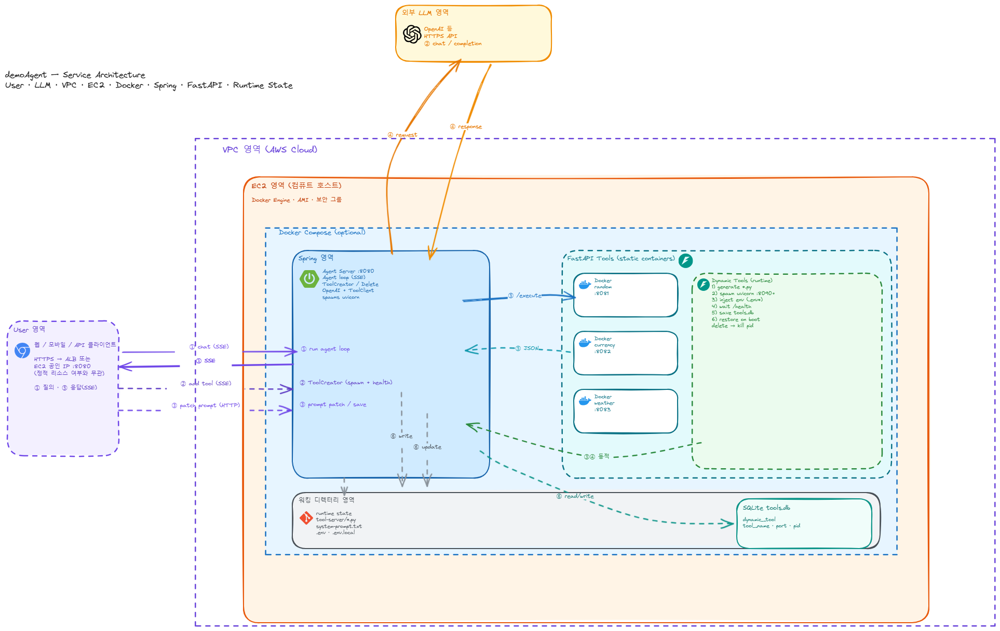
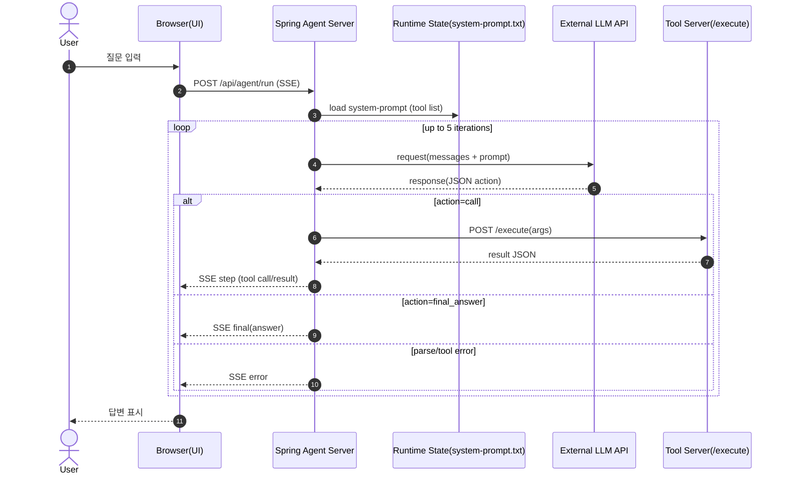
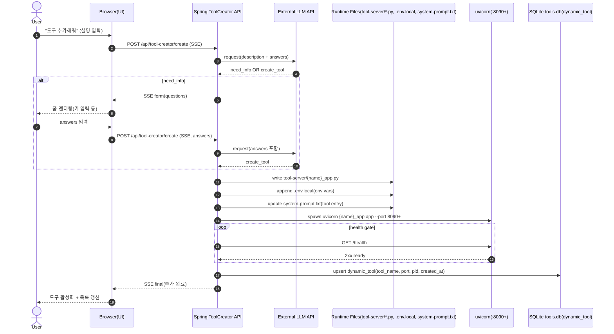
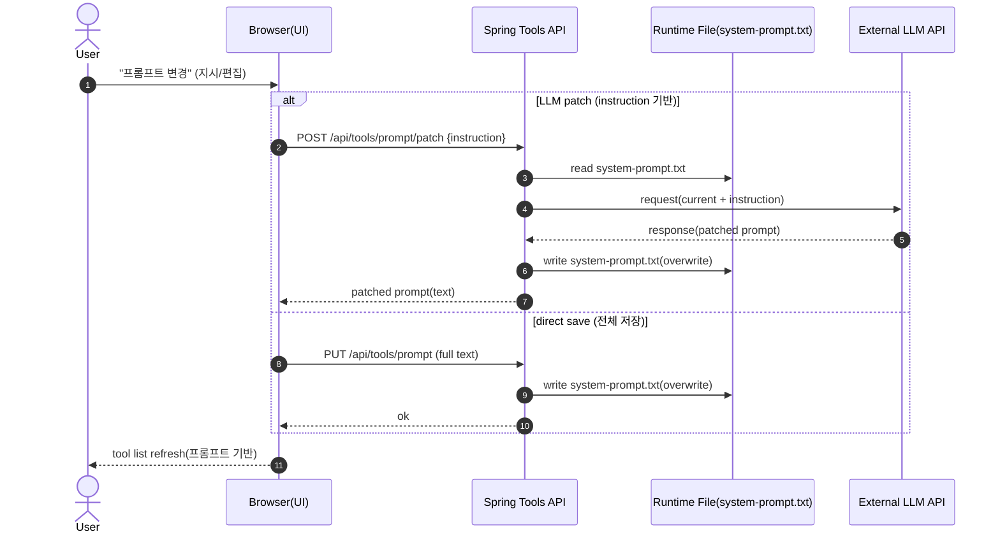

# demoAgent

LLM이 출력한 JSON 지시문을 Agent 서버가 파싱하여 외부 Tool API를 호출하고, 결과를 다시 LLM에 전달해 최종 답변을 생성하는 데모 시스템

## 문서

| 문서 | 설명 |
|------|------|
| [요구사항](./requirements.md) | MVP 기능 요구사항 |
| [설계 문서](./docs/superpowers/specs/2026-04-27-demoagent-design.md) | 아키텍처, 컴포넌트, Agent 루프, API 스펙 |

## 다이어그램

### Architecture



- Excalidraw 소스: `docs/superpowers/architecture-demoagent.excalidraw`
- 재생성: `python scripts/build_architecture_excalidraw.py`

### Sequence diagrams

- 로컬에서 UI로 보기/복사: `http://localhost:8080/sequence.html`

아래 mermaid는 그대로 GitHub에서 렌더링되며, Mermaid 에디터에도 복사해 사용할 수 있습니다.

<details>
<summary>① Chat — Agent 실행(도구 호출 포함)</summary>



</details>

<details>
<summary>② Add Tool — 도구 추가(키 입력 → 생성 → health gate → 영속화/복원)</summary>



</details>

<details>
<summary>③ Patch Prompt — 프롬프트 변경(패치/저장)</summary>



</details>

## 로컬 실행

### Tool servers (local)

`tool-server/`에서 기본 제공 도구 서버 3개를 한 번에 실행:

Git Bash:

```bash
./run_all.sh
```

PowerShell:

```powershell
.\run_all.ps1
```

스크립트가 자동으로 `.venv`를 만들고(가능하면 `py -3.12` 사용), 의존성을 설치한 뒤 아래 서버를 실행합니다.
- `random` → `http://127.0.0.1:8081/execute`
- `currency` → `http://127.0.0.1:8082/execute`
- `weather` → `http://127.0.0.1:8083/execute`

### Agent server (local)

repo 루트에서:

```bash
./gradlew bootRun
```

브라우저에서 `http://localhost:8080` 접속.
